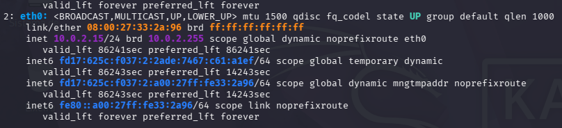
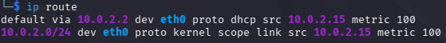
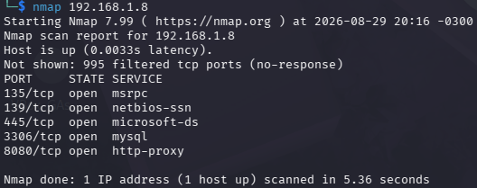
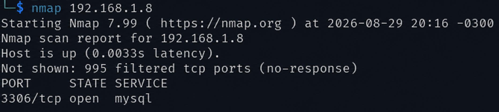
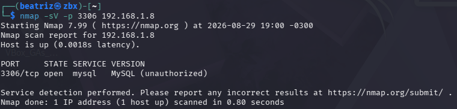
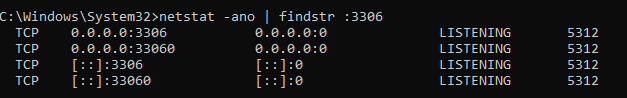
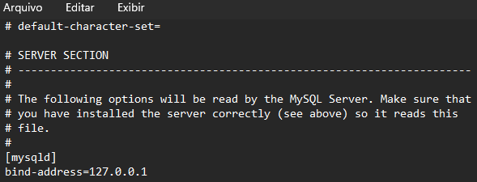
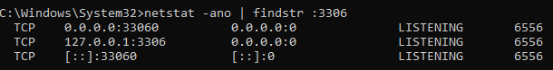
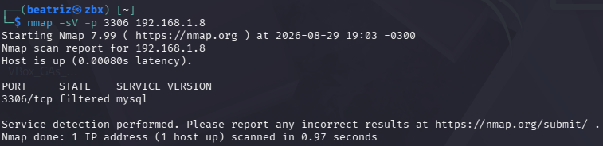

# Hardening de MySQL com Kali Linux e Nmap
<br>

## 🧪 Sobre o projeto

Neste laboratório, analisei a exposição de um serviço MySQL executado em uma máquina Windows utilizando Kali Linux e Nmap.

Durante o reconhecimento, identifiquei a porta `3306/tcp` acessível pela rede. Após investigar a configuração do serviço, apliquei uma medida de hardening para restringir o MySQL somente ao acesso local e validei a alteração com um novo scan.


> ⚠️ Laboratório realizado em ambiente próprio e controlado.
<br>

## Ambiente

- Kali Linux (VirtualBox)
- Windows
- MySQL Server 8.0
- Nmap
- Netstat
<br>

## Identificação da rede

Antes de iniciar o reconhecimento, verifiquei o endereço IP da máquina Kali:

```cmd
ip a
```



<br>

Em seguida, consultei a tabela de roteamento para identificar a rota padrão e o gateway utilizado pela máquina virtual:

```cmd
ip route
```



<br>


Para validar a comunicação entre o Kali Linux e a máquina Windows, realizei um teste de conectividade utilizando o `ping`:

```cmd
ping -c 4 192.168.1.8
```



<br>

## Reconhecimento

Com a conectividade validada, realizei um scan no host Windows para identificar as portas acessíveis:

```cmd
nmap 192.168.1.8
```
<br>


O scan identificou algumas portas abertas, entre elas a porta `3306/tcp`, normalmente associada ao MySQL.



<br>


Em seguida, utilizei a detecção de serviço especificamente na porta 3306:

```cmd
nmap -sV -p 3306 192.168.1.8
```
<br>

**Resultado**:

```text
3306/tcp open mysql MySQL (unauthorized)
```



<br>


## Validação no Windows

No Windows, verifiquei localmente o estado da porta 3306:

```cmd
netstat -ano | findstr :3306
```

O resultado mostrou o MySQL escutando em:

```text
0.0.0.0:3306
```
<br>

Isso indicava que o serviço estava escutando nas interfaces IPv4 disponíveis da máquina.



<br>


## 🔒 Hardening

Como o MySQL era utilizado apenas localmente, alterei o arquivo `my.ini` para restringir o serviço ao endereço de loopback.
<br>

Na seção `[mysqld]`, adicionei:

```cmd
bind-address = 127.0.0.1
```



Após salvar a configuração, reiniciei o serviço MySQL para aplicar a alteração.

<br>


## Validação após o hardening

Após a alteração, executei novamente:

```cmd
netstat -ano | findstr :3306
```

Dessa vez, o MySQL passou a escutar em:

```text
127.0.0.1:3306
```



<br>

Por fim, repeti o scan a partir do Kali:

```cmd
nmap -sV -p 3306 192.168.1.8
```
<br>

**Resultado**:

```text
3306/tcp filtered mysql
```



<br>

## Antes e depois

| Antes | Depois |
|---|---|
| `0.0.0.0:3306` | `127.0.0.1:3306` |
| Nmap: `open` | Nmap: `filtered` |
| Serviço acessível pela rede | Serviço restrito ao acesso local |

<br>

## 💡 Aprendizados

O laboratório permitiu praticar conceitos de redes, conectividade entre máquinas, reconhecimento com Nmap, análise de portas e serviços, validação com Netstat e aplicação de hardening para redução da superfície de exposição.